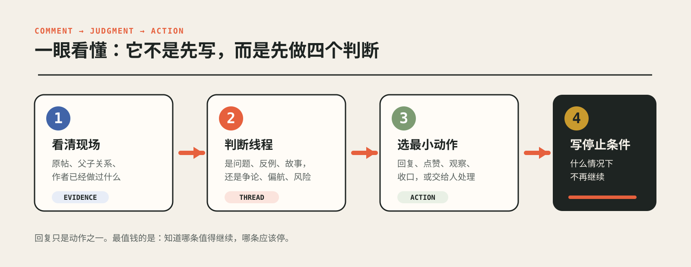
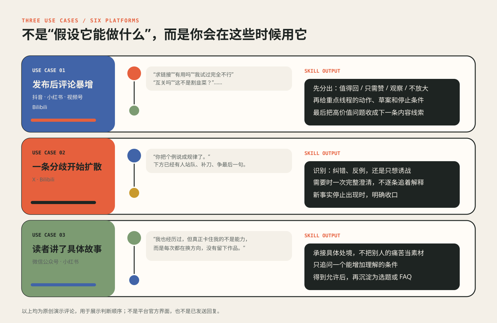
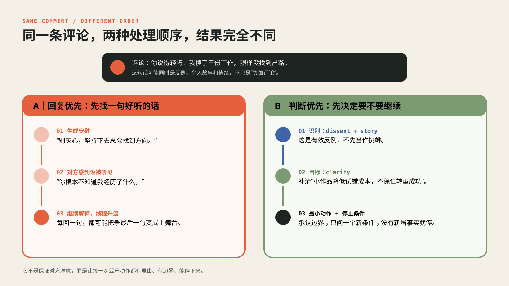
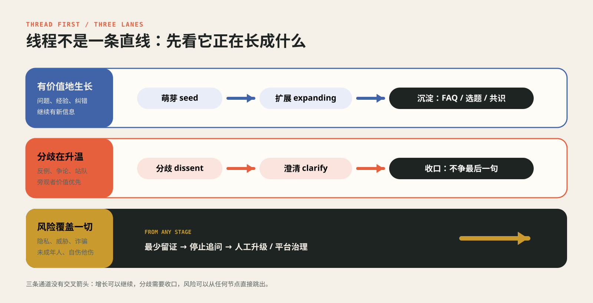

<div align="center">

**中文** · [English](./README.en.md)

# 评论罗盘 · Comment Compass

**先看懂评论区正在发生什么，再决定回不回、怎么回、什么时候停。**

对外昵称：**评论罗盘** · 技术安装名：`huan-an-comment-ops` · 记忆句：**先判断，再回复。**

**作者：** [焕安 · X @heyHuanAn](https://x.com/heyHuanAn)

[](./docs/evidence-base.md)
[](./skills/huan-an-comment-ops/SKILL.md)
[](./skills/huan-an-comment-ops/scripts)
[](./LICENSE)

</div>


**评论罗盘**（技术安装名 `huan-an-comment-ops`）是一个给创作者、品牌和社区运营者使用的评论运营 Agent Skill。

它最强的地方，不是把一句回复润色得更漂亮，而是能在动手前看清：这是一条问题、一段真实经历、一个有效反例，还是正在抢走整个评论区的争论；这条值得回，还是只需点赞、观察、收口或交给人处理。

一句话：**把“回复评论”升级成一套可解释、能停止的公开判断。**

## 最快用法

### 极简版（默认推荐）

把评论区截图、作品链接、评论导出或作品文稿扔进来，然后只说：

```text
处理
```

分线程、安全判断、动作选择和停止条件都由 Skill 在内部完成。你先看结果，不需要先学术语或复制长提示词。

### 建议版（想控制目标时）

```text
使用评论罗盘处理这些资料。
这次目标是找出值得回应的问题和真实反例。
请给我：判断、建议动作、需要时的回复，以及什么时候停。
```

## 一眼看懂



| 你提供 | Skill 负责 |
|---|---|
| 原帖摘要、评论截图或导出 | 分清原评论、楼中楼、作者已做动作和仍未知的信息 |
| 平台、目标和允许的动作 | 判断重点线程、每轮唯一目标和最小充分动作 |
| 你的语气与边界 | 生成可直接修改的回复、处置理由、风险和停止条件 |
| 一批评论 | 分层抽样、优先队列、内容线索与后续观察清单 |

回复不是默认答案。它可以建议 `reply / like / observe / close / hide / report / escalate-human`，也可以明确告诉你：**这条不值得继续。**

## 适用场景



### 1. 发布后评论突然变多

适合抖音、小红书、视频号和 Bilibili。先把“值得回、只需赞、继续观察、不应放大”分开，再处理重点线程，不被评论数量牵着走。

### 2. 一条分歧开始扩散

适合 X 和 Bilibili。它会先分清有效纠错、真实反例和诱战，再决定是否一次完整澄清。线程只剩重复立场时，停止追着解释。

### 3. 读者留下了具体经历

适合微信公众号和小红书。它会承接处境，只问一个真正增加理解的问题；获得允许后，再把共性问题沉淀成 FAQ、选题或下一篇内容。

## 同一条评论，两种处理顺序



评论：

> 你说得轻巧。我换了三份工作，照样没找到出路。

普通回复器容易先安慰、解释或反驳。这个 Skill 会先判断它是 `dissent + story`，把本轮目标设为 `clarify`，再给最小动作：承认原观点的边界，只在能增加新条件时追问，并提前写好停止条件。

候选回复：

> 你这个反例很重要。我讲的是怎样降低试一次的成本，不是说做个小作品就一定能解决转型。如果愿意只讲一个条件，三次变化里最影响结果的是什么？不方便展开也没关系。

它不保证对方满意。它做的是把这次公开动作的理由、边界和停止条件摆出来。

## 线程优先



内部仍保留完整状态：`seed / expanding / contending / polarizing / derailing / acute-risk / exhausted`。对外先用三条通道呈现：

- 有新问题、新事实和新经验：继续生长；
- 开始站队、重复和争最后一句：澄清一次，然后收口；
- 出现隐私、威胁、诈骗、未成年人或自伤他伤：从任何节点直接转人工与平台治理。

完整定义见 [`thread-state-machine.md`](./skills/huan-an-comment-ops/references/thread-state-machine.md)。

## 四种模式

| 模式 | 适合什么任务 | 交付什么 |
|---|---|---|
| 快速分诊 | 一条或少量评论 | 动作、回复草案、理由、风险、停止条件 |
| 运营批次 | 爆款后评论区、批量评论、争论管理 | 优先队列、重点线程、不回复/收口/升级清单、内容线索 |
| 研究评估 | 比较作品或账号、判断评论增长是否健康 | 评论向量、账号内突破倍数、证据缺口、实验建议 |
| 安全处置 | 威胁、隐私、诈骗、自伤他伤等 | 最少留证、停止追问、平台治理建议、人工升级 |

## 安装：Claude Code 与 Codex 主推

### 通用安装

```bash
npx -y skills add hosemo-hub/huan-an-comment-ops -g --all
```

只查看仓库里有哪些 Skill：

```bash
npx -y skills add hosemo-hub/huan-an-comment-ops --list
```

### Claude Code

最省事的方法，是把仓库链接直接发给 Claude Code：

```text
帮我安装并使用这个 Skill：
https://github.com/hosemo-hub/huan-an-comment-ops
```

也可以运行上面的通用命令。手动安装时，把 `skills/huan-an-comment-ops` 整个目录放到 `~/.claude/skills/huan-an-comment-ops/`，新开会话后调用。

### Codex

在 Codex CLI 或桌面端所在环境运行通用命令；也可以让 Codex 直接安装仓库链接。手动目录为 `~/.codex/skills/huan-an-comment-ops/`。安装后新开任务，直接说：

```text
使用 huan-an-comment-ops 分诊这些评论，按线程给动作、回复草案和停止条件。
```

### CodeBuddy / WorkBuddy（国内与海外版本）

国内 CodeBuddy、海外 CodeBuddy / WorkBuddy 同样先运行通用安装命令：

```bash
npx -y skills add hosemo-hub/huan-an-comment-ops -g --all
```

安装后新开任务，用 `/skills` 或客户端的 Skills 面板确认 `huan-an-comment-ops` 已加载。只有通用命令不可用时，才需要走 **Settings → Skills → Import Skill** 的手动导入。参考 [腾讯云 Skills 文档](https://cloud.tencent.com/document/product/1831/137020) 与 [CodeBuddy 国际版 Skills 文档](https://intl.cloud.tencent.com/document/product/1256/77295?lang=en)。

## 重点：手机豆包也能装

下面这条路径按当前豆包手机端“工作任务”界面整理，不需要手动复制一堆文件：

1. 打开豆包 App，新建对话；
2. 点左下角当前显示的“快速”，切换为 **工作任务 Auto**；
3. 确认底部 **云电脑** 显示在线；
4. 发送这句话：

```text
请把这个仓库安装成可调用的技能包：
https://github.com/hosemo-hub/huan-an-comment-ops

安装完成后告诉我技能名称，并让我用一张评论区截图测试。
```

5. 安装完成后，当前会话底部会出现 **技能**；点开后选择 `huan-an-comment-ops`；
6. 把评论截图和作品链接扔进去，只说“处理”；
7. 如果技能列表还没刷新，新建一个 **工作任务 Auto** 会话再看一次。

手机上装好后，电脑端登录同一豆包账号也能继续使用这台云电脑；还可以在“工作设备”里添加自己的电脑。完整图文步骤见 [`docs/doubao-quickstart.md`](./docs/doubao-quickstart.md)。

## 资料怎么给

极简版只要两样：**评论区截图 + 作品链接**，然后说“处理”。你也可以附文章链接、短视频文稿或逐字稿；如果当前模型不能直接读取某个平台的视频，就再补文稿、字幕或关键画面。

想明确目标、允许动作或语气时，再使用下面的建议版：

```text
平台：小红书
附件：评论区截图.png
作品链接：https://...
作品补充：文章、短视频文稿或一句话摘要（能读链接时可省略）
目标：收集真实反例，不追求评论数量
允许动作：回复、点赞、观察、人工升级
作者已做动作：给两条具体经验点过赞，尚未回复

请使用评论罗盘：先还原截图里的父子评论关系，再给重点线程、最小动作、
需要时的回复草案、理由和停止条件。
```

批量任务可直接使用 [`comment-batch.example.json`](./skills/huan-an-comment-ops/assets/comment-batch.example.json)。需要 Python 3 时，Skill 会调用两个确定性统计脚本；单条分诊通常不需要脚本。

## 它刻意不做什么

- 不刷量、互赞互评、伪装路人或制造虚假共识；
- 不用挑衅、羞辱、故意错误或争最后一句换互动；
- 不自动执行回复、点赞、置顶、隐藏、删除或举报；
- 不把私信、病例、住址、手机号和未成年人信息变成公开素材；
- 不承诺提高推荐、评论数、成交或涨粉。

## 验证状态

当前版本为 `0.1.0-trial`。Skill 结构、两个统计脚本、匿名化回归案例、跨平台发现研究、GitHub 远程树和 `npx skills --list` 已检查；真实平台前向 A/B、所有客户端的干净环境安装回放，以及“作者回复导致增长”的因果验证仍未完成。

这不妨碍你现在用它做判断，但不要把候选回复当成已发布动作，也不要把评论增长自动归因给这个 Skill。完整范围见 [`docs/evidence-base.md`](./docs/evidence-base.md)。

## 仓库结构

```text
huan-an-comment-ops/
├── docs/                              # 使用说明、证据边界与介绍图片
│   ├── doubao-quickstart.md           # 豆包手机端安装与使用教程
│   ├── evidence-base.md               # 已验证、未验证与测试范围
│   └── images/                        # README 配图与群二维码海报
├── skills/huan-an-comment-ops/        # 可被 Agent 发现的 Skill 主目录
│   ├── SKILL.md                       # 能力边界、触发条件与工作流真源
│   ├── assets/                        # 批量评论输入样例
│   ├── evals/                         # 匿名化回归测试
│   ├── references/                    # 平台、线程、实验与安全参考
│   └── scripts/                       # 确定性统计脚本
├── README.md                          # 中文产品介绍
├── README.en.md                       # English introduction
└── LICENSE                            # 文档与脚本许可
```

## 许可

Skill 说明、references、assets 与 evals 采用 [CC BY-NC 4.0](./LICENSE)：个人使用、研究和非商业改编需要署名；商业使用需单独授权。它是 `source-available`，不是 OSI 意义的开源软件。

`scripts/` 下的确定性 Python 脚本另按 [MIT License](./skills/huan-an-comment-ops/scripts/LICENSE) 提供。

## 反馈与讨论

我做这个 Skill，是因为我不想再把评论区交给一句万能回复。真正难的从来不是“怎么说得更好听”，而是“这一次公开回应，究竟在放大什么”。

最有价值的反馈是：它在哪种评论里判断错了、你为什么没有采用建议、哪条停止条件来得太早或太晚。请在 [GitHub Issues](https://github.com/hosemo-hub/huan-an-comment-ops/issues) 提交已公开或充分脱敏的案例。

扫码加入「评论运营 Skill」内测群：


群码有效期至 **2026-09-09**。失效后请到 [GitHub Issues](https://github.com/hosemo-hub/huan-an-comment-ops/issues) 留言；我会不定期更新。

---

由「焕安聊出路」发起：用 AI 减少整理与生产摩擦，把判断、取舍和责任留给人。
