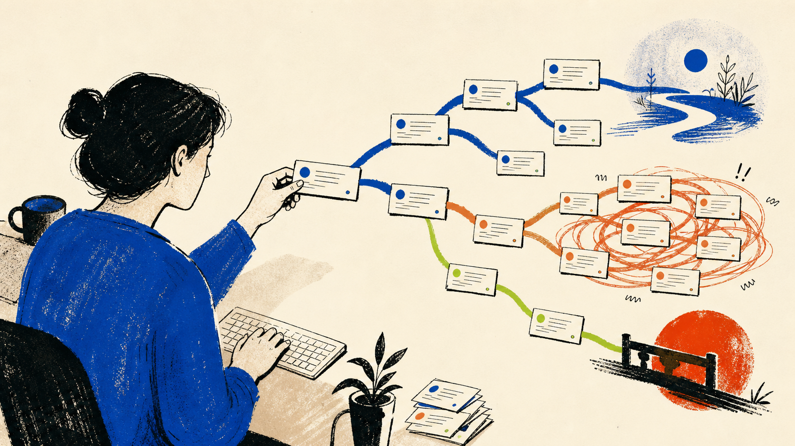
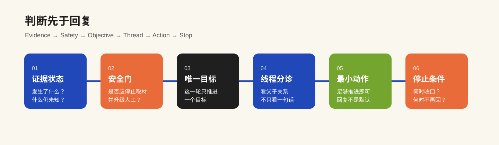
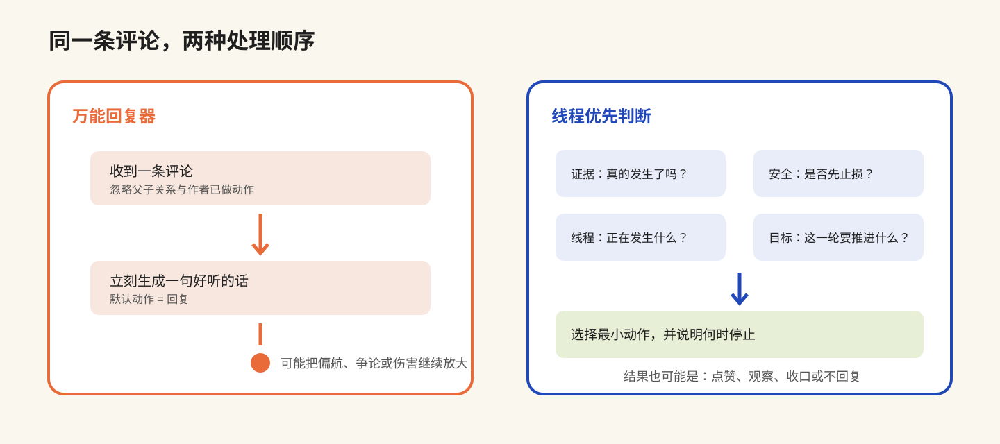
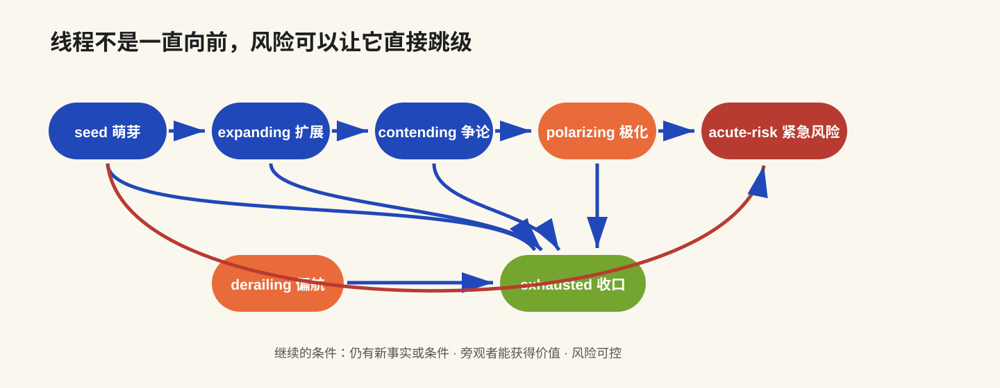

<div align="center">

**中文** · [English](./README.en.md)

# huan-an-comment-ops

**先判断该不该回、为什么回、何时停，再写回复。**

[](./docs/evidence-base.md)
[](./skills/huan-an-comment-ops/SKILL.md)
[](./skills/huan-an-comment-ops/scripts)
[](./LICENSE)

</div>



`huan-an-comment-ops` 是一个跨平台评论运营与社区风险控制 Skill。它不把评论区当成“高情商回复”生产线，而是先分清证据、识别线程状态、选择最小充分动作，并写出明确的停止条件。

它默认只分析和拟稿，不自动回复、点赞、隐藏或举报，也不承诺涨粉、推荐或评论增长。

## 一眼看懂

| 常见做法 | huan-an-comment-ops |
|---|---|
| 看到评论就生成一句回复 | 先判断这条评论和整个线程是否值得继续 |
| 把每条评论当成孤立文本 | 保留父子关系，识别线程正在扩展、争论、极化还是偏航 |
| 把评论更多当成成功 | 分开看知识、关系、噪声与伤害成本 |
| 只给一句“建议回复” | 同时给动作、理由、风险、证据状态与停止条件 |
| 用挑衅或互赞换互动 | 禁止刷量、伪装、诱战和自动平台写操作 |



## 一个假设场景

> 原帖：工作转型可以先从小作品开始。<br>
> 评论：你说得轻巧，我换了三份工作还是没找到出路。

普通回复器可能直接安慰、说服或追问更多痛苦经历。这个 Skill 会先把它视为与原帖有关的反例，再做判断：

| 字段 | 候选判断 |
|---|---|
| 证据状态 | `observed`（若来自截图或公开页面） |
| 贡献类型 | `dissent` + `story` |
| 线程阶段 | `seed` |
| 本轮主目标 | `clarify` |
| 最小动作 | 承认边界；只在能增加新条件时追问 |
| 停止条件 | 对方不愿展开，或下一轮只重复立场 |

候选回复可以是：

> 你这个反例很重要。我这里讲的是怎样降低试一次的成本，不是说小作品一定能解决转型。如果愿意只讲一个条件，三次变化里最影响结果的是什么？不方便展开也没关系。

这不是唯一正确答案，也没有被真实发送。它展示的是判断顺序：先识别反例，再补边界，最后才决定要不要追问。



## 它能做什么

| 模式 | 适用任务 | 主要输出 |
|---|---|---|
| 快速分诊 | 单条或少量评论 | 建议动作、回复/处置文本、理由、风险、停止条件 |
| 运营批次 | 爆款后评论区、批量评论、争论管理 | 分层抽样、优先队列、重点线程动作、不回复/隐藏/升级清单、内容线索 |
| 研究评估 | 比较作品或账号、判断评论增长是否健康 | 评论向量、账号内突破倍数、证据缺口、实验设计 |
| 安全处置 | 威胁、隐私、未成年人、自伤他伤、诈骗等 | 最少留证、停止追问、平台治理建议、人工升级 |

## 核心判断系统

### 1. 证据分账

- `observed`：截图、导出或公开页面可见；
- `reported`：创作者陈述但未独立核验；
- `inferred`：根据上下文推断；
- `unknown`：缺少证据。

建议回复不等于已经回复，模拟动作不等于平台动作，评论增加也不自动等于作者回复带来的结果。

### 2. 线程优先

评论会被标为 `story / question / correction / insight / affiliation / play / dissent / provocation / spam / harm`；线程会进入 `seed / expanding / contending / polarizing / derailing / acute-risk / exhausted` 中的一个阶段。



### 3. 唯一主目标

每轮只选择一个主目标：`care / knowledge / clarify / community / research / conversion / stop`。不能把“让评论更多”单独设为目标。

### 4. 最小充分动作

动作可以是 `reply / like / pin / observe / close / hide / remove-if-supported / report / escalate-human`。回复不是默认答案。

### 5. 明确停止条件

连续两轮没有新增事实、开始争夺最后一句、出现攻击或隐私、话题偏航、作者已完成澄清，或运营成本超过旁观者价值时，应该收口。

## 安装

```bash
npx -y skills add hosemo-hub/huan-an-comment-ops -g --all
```

查看但不安装：

```bash
npx -y skills add hosemo-hub/huan-an-comment-ops --list
```

需要 Python 3 才能运行 Skill 内的两个确定性统计脚本。仅做单条评论分诊时，不一定会调用脚本。

### WorkBuddy

当前不把 `npx --all` 写成已原生支持所有 WorkBuddy 版本。更稳妥的方式是把仓库中的 `skills/huan-an-comment-ops` 整个文件夹复制到：

- Windows：`%USERPROFILE%\.workbuddy\skills\huan-an-comment-ops\`
- macOS / Linux：`~/.workbuddy/skills/huan-an-comment-ops/`

然后新开会话，确认客户端能读取其中的 `SKILL.md`。

## 试一下

```text
使用 huan-an-comment-ops 分诊下面这些评论。
先区分原评论、作者已经做过的动作和还没发送的建议，
再按线程给出最小动作、回复草案和停止条件。
不要自动发布。
```

最好同时提供：平台、原帖摘要、评论父子关系、观察时间、作者已经做过的动作、允许的动作与期望语气。缺失信息会标成 `unknown`，不会补造现场。

## 结构化输入

批量任务可参考 [`comment-batch.example.json`](./skills/huan-an-comment-ops/assets/comment-batch.example.json)。核心字段包括：

```json
{
  "platform": "example-platform",
  "content_goal": "collect useful counterexamples",
  "observed_at": "2026-08-30T12:00:00+08:00",
  "allowed_actions": ["reply", "like", "observe", "escalate-human"],
  "comments": []
}
```

原始字段不会被静默改写；全量不可见时，抽样结果不会冒充全量比例。

## 跨平台边界

核心机制可以迁移，但平台功能、互动文化和推荐效果不能直接迁移。

| 平台 | 当前覆盖重点 | 证据边界 |
|---|---|---|
| 微信公众号 | 留言策展、具体承接、避免把创伤当素材 | 有项目历史材料，不代表公开全平台总体 |
| 小红书 | 经验交换与互赞/导流噪声分离 | 有发现样本，非生产 A/B |
| Bilibili | 顶层、楼中楼、梗扩散、知识共创与未成年人风险 | 有发现样本，发布时粉丝多为未知 |
| YouTube | 高热评论抽样、置顶与治理工具 | 有公开样本与官方治理资料 |
| X | 扩散快、受众边界弱、一次完整澄清优先 | 核心规则可用，效果未验证 |
| Reddit | 社区规则和版主治理优先 | 有发现样本，不能越过 subreddit 规则 |
| 抖音 / TikTok / 视频号 | 迁移待验证 | 尚无合格可审计语料，不宣称已覆盖 |

## 验证状态

当前版本为 `0.1.0-trial`。

已完成：

- Skill 结构与入口检查；
- 两个 Python 脚本的确定性样例与语法检查；
- 匿名化回归案例；
- 跨平台最大差异发现研究与行为冒烟；
- GitHub 远程树与 `npx skills --list` 可发现性核验。

尚未完成：

- 真实平台前向 A/B；
- “作者回复导致推荐、涨粉或评论增长”的因果验证；
- 抖音、TikTok、视频号合格语料覆盖；
- 所有客户端和 WorkBuddy 版本的干净环境安装回放。

完整证据范围见 [`docs/evidence-base.md`](./docs/evidence-base.md)。

## 不做什么

- 不刷量、互赞互评、伪装路人或制造虚假共识；
- 不用羞辱、挑衅、故意错误或争夺最后一句换热度；
- 不自动执行回复、点赞、置顶、隐藏、删除或举报；
- 不把私信、病例、住址、手机号和未成年人信息转成公开素材；
- 不把“看起来像”直接判成抄袭或侵权；
- 不承诺提高推荐、评论数、成交或涨粉。

## 仓库结构

```text
huan-an-comment-ops/
├── docs/
│   ├── evidence-base.md
│   └── images/
├── skills/huan-an-comment-ops/
│   ├── SKILL.md
│   ├── agents/openai.yaml
│   ├── assets/comment-batch.example.json
│   ├── evals/evals.json
│   ├── references/
│   └── scripts/
├── README.md
├── README.en.md
└── LICENSE
```

## 许可

Skill 说明、references、assets 与 evals 采用 [CC BY-NC 4.0](./LICENSE)：允许非商业使用、研究和改编，但需要署名；商业使用需单独授权。它是带非商业限制的 `source-available`，不是 OSI 意义的开源软件。

`scripts/` 下的确定性 Python 脚本另按 [MIT License](./skills/huan-an-comment-ops/scripts/LICENSE) 提供。

## 反馈

最有价值的反馈不是“好用”，而是：它在哪种评论里判断错了、你为什么没有采用建议、哪条停止条件来得太早或太晚。

请只提交已公开或充分脱敏的评论，不要上传私信、个人联系方式、病例、未成年人身份或其他敏感材料。

---

由「焕安聊出路」发起：用 AI 减少整理与生产摩擦，但把判断、取舍和责任留给人。
